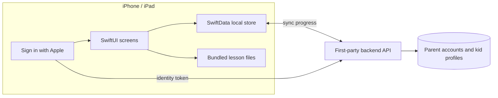

# Money lessons with Penny the Pangolin

> **Status: concept stage.** Nothing is built yet. This repository has no app code, no Xcode project and no backend. This README describes the plan so the design, lessons and tech can be reviewed before any real work starts.

An iPhone and iPad app that teaches children the basics of money through short, playful, guided lessons, in the spirit of Duolingo. A friendly pangolin named **Penny** walks kids through a path of levels. Each level explores one money idea, from "What is money?" to "How can money grow?"

The app does not have a final name yet. This README calls it **"the app."**

---

## Contents

1. [Who it's for](#1-who-its-for)
2. [Meet Penny, the guide](#2-meet-penny-the-guide)
3. [How learning works](#3-how-learning-works)
4. [A sample lesson, step by step](#4-a-sample-lesson-step-by-step)
5. [The level map](#5-the-level-map)
6. [Parent account, kid profiles and the parent dashboard](#6-parent-account-kid-profiles-and-the-parent-dashboard)
7. [Language and tone rules for children](#7-language-and-tone-rules-for-children)
8. [Planned iOS tech direction](#8-planned-ios-tech-direction)
9. [Children's privacy and the App Store Kids Category](#9-childrens-privacy-and-the-app-store-kids-category)
10. [Roadmap and status](#10-roadmap-and-status)

---

## 1. Who it's for

| | |
|---|---|
| **Learners** | Children aged **6 to 11**. That matches two of Apple's Kids Category age bands (6–8 and 9–11). |
| **Grown-ups** | Parents and guardians. They set up the app, create each child's profile and follow progress in a locked parent dashboard. |
| **Platform** | iPhone and iPad (iOS). iPad matters most, because many families share one. |
| **Goal** | Kids understand everyday money ideas (earning, saving, spending wisely, budgeting, banks, taxes, giving and growing money) through small daily lessons they actually want to finish. |

**What makes it different from a money worksheet:**

- Lessons take **3 to 5 minutes** and teach **one idea** each.
- Every screen has a **picture**: Penny, or people acting out the right answer.
- **Mistakes are safe.** A wrong answer turns into a hint, never a punishment.
- Coins in the app are **pretend "play coins."** Kids never spend real money.

---

## 2. Meet Penny, the guide

Penny was chosen from four guide-animal concepts (a squirrel, a pangolin, an octopus and a beaver) that were reviewed on a visual concept board.

| | |
|---|---|
| **Name** | Penny (a working name that still needs a trademark check before launch) |
| **Animal** | Pangolin |
| **Personality** | Calm, kind and careful. A little shy but brave. When something seems unsafe she curls into a ball, then teaches kids to stop and ask a grown-up. |
| **Look** | Warm copper body covered in round scales that look like shiny coins, a soft peach face with a long snout, big friendly eyes and a teal scarf. |
| **Teaching superpower** | Keeping money safe, and noticing small things that add up |

### Colors

| Role | Name | Hex |
|---|---|---|
| Body | Copper | `#C9793A` |
| Scarf and main buttons | Deep teal | `#1F6F78` |
| Face and belly | Peach | `#FFD9B8` |
| Highlights | Sky teal | `#6CC4C9` |

### How Penny talks

| Moment | Sample line |
|---|---|
| Hello | "Hi, Mia! I'm Penny. My scales look like coins! Want to learn how money works?" |
| Teaching | "A need is something you must have, like food or a warm coat. A want is a fun extra, like a new toy." |
| After a mistake | "That's okay, Mia! Mistakes help our brains grow. Let's try one more time." |
| Level done | "You did it, Mia! Look, a shiny new coin just grew on my scales!" |

### Why a pangolin?

- **Money is part of her design.** Her coin scales make her easy to recognize and remember, and they double as a reward: finishing lessons adds shiny new scales.
- **Her careful personality fits the lessons.** Stopping, thinking and asking a grown-up are exactly the habits the Money Safety and Smart Spending levels teach.
- **She sparks curiosity.** Pangolins are real, endangered animals, and many kids haven't met one yet.

**Known trade-off:** many young children don't know what a pangolin is. A short "Meet Penny" intro explains what a pangolin is and why her scales look like coins before the first lesson.

### Staying clearly different from Duolingo

A path of levels and short daily lessons are common learning-app patterns. We borrow the *idea*, never the look.

- No owls or birds, and no name close to "Duo."
- Green is never the main brand color. The palette is copper, teal and peach.
- The streak icon is a **coin**, not a flame.
- There are **no hearts or lives**. Mistakes never lock a child out of learning.
- The art style, characters and phrases are our own.

---

## 3. How learning works

### Structure

```
World  →  Level  →  Lesson  →  Screens
  4        13       ~5 each     6–8 each
```

- **Worlds** group related levels (for example "Save & Spend").
- **Levels** each explore one money idea and unlock in order, so every idea builds on the one before.
- **Lessons** take 3 to 5 minutes and teach one small piece of that idea.
- A friendly **level check** at the end of each level mixes questions from its lessons. It isn't a test anyone can fail. Kids simply retry questions until they get them.

### Screen types inside a lesson

| Screen | What the child does |
|---|---|
| **Hello** | Penny greets the child by name and says the one goal of the lesson. |
| **Learn** | One idea shown with pictures first and very few words. |
| **Tap to choose** | Answer a question with big picture buttons (2 to 3 choices). |
| **Sort it** | Drag pictures into groups, like "Need" and "Want." |
| **Story choice** | Help a character decide what to do with their coins. |
| **Count it** | Add or split play coins using kid-sized numbers. |
| **Yay!** | Celebration, stars, play coins and the streak. |

**Every screen shows a picture.** That's either Penny or people acting out the right answer. A child who can't read every word should still be able to follow the lesson from the pictures.

### Right and wrong answer effects

| | Right answer | Wrong answer |
|---|---|---|
| **Motion** | The chosen answer pops, and coins and sparkles burst out | The chosen answer does a gentle wobble |
| **Penny** | Hops happily | Curls into a ball, then peeks out to help |
| **Sound** | A short, happy chime | A soft "boop" (no buzzer) |
| **Touch** | A light haptic tap | None |
| **Message** | "Yes, Mia! A coat keeps us warm and safe. That's a need!" | "Good try, Mia! See how the coat keeps her warm in the snow? That makes it a need." |
| **What happens next** | Move on | The picture becomes the hint, then the child tries again. The question comes back later in the lesson. |

There is never a red X, a scary sound or a lost life. When the device has **Reduce Motion** turned on, bursts and wobbles become soft fades. Sounds and music can be turned off.

### Rewards and progress

| Reward | How it works |
|---|---|
| **⭐ Stars** | Up to 3 stars per lesson. Replaying a lesson can earn more. |
| **🪙 Play coins** | Pretend money earned by learning. Kids spend it on stickers and outfits for their avatar and for Penny, which also lets them practice budgeting. Play coins can **never** be bought with real money. |
| **🪙 Streaks** | Counts days with at least one finished lesson. A missed day never scolds or guilt-trips the child. |
| **Penny's scales** | Finishing a level adds new shiny scales to Penny. |
| **The map** | Each child has their own level path showing what's done, what's next and what's still locked. |

---

## 4. A sample lesson, step by step

**Level 2 · Needs & Wants · Lesson 1** (about 3 minutes), played by a child named Mia.

1. **Hello.** Penny bounces in: *"Hi, Mia! Today we'll learn about needs and wants!"*
2. **Learn.** Two pictures. A child in a warm coat in the snow is labeled **NEED**: *"Something we must have to stay safe and healthy."* A child holding a balloon next to a teddy bear is labeled **WANT**: *"A fun extra. Nice, but we're okay without it."*
3. **Tap to choose.** A snowy picture and the question *"It's snowing outside. Is a warm coat a need or a want?"* with two big buttons, 👍 Need and 🎈 Want. Penny adds: *"Look at the picture, Mia!"*
4. **Right answer.** The button pops, coins and sparkles burst out, and Penny hops: *"Yes, Mia! A coat keeps us warm and safe. That's a need!"*
5. **Or a wrong answer.** The button wobbles and Penny curls up, then peeks out: *"Good try, Mia! See how the coat keeps her warm in the snow? That makes it a need."* Mia tries again.
6. **Sort it.** Mia drags water, a bed, a balloon and ice cream into the Need and Want baskets. Each drop gets the same right or wrong effect.
7. **Yay!** Mia's avatar celebrates next to Penny: *"Lesson done, Mia!"* ⭐⭐⭐, +10 play coins, 🪙 3-day streak.

---

## 5. The level map

13 levels in 4 worlds. Kid-facing summaries are written the way Penny would say them. "Grown-up idea" is the concept underneath.

### World 1 · Money Basics

| # | Level | What kids learn | Grown-up idea |
|---|---|---|---|
| 1 | 🪙 **What Is Money?** | "Money is something people trade for the things they need and want." | Money as a trading tool; coins, bills and digital money |
| 2 | 🧥 **Needs & Wants** | "Needs keep us safe and healthy. Wants are fun extras." | We can't have everything, so we make choices |
| 3 | 🧹 **Earning Money** | "People earn money by doing jobs and helping others." | Work, jobs, income, allowance |

### World 2 · Save & Spend

| # | Level | What kids learn | Grown-up idea |
|---|---|---|---|
| 4 | 🫙 **Saving Up** | "Saving means keeping some money now so you can use it later." | Waiting for a bigger reward; savings goals |
| 5 | 🛒 **Smart Spending** | "Stop, think and compare before you buy something." | Comparing prices, trade-offs, how ads try to convince us |
| 6 | 📝 **Making a Budget** | "A budget is a money plan: some to spend, some to save and some to give." | Budgeting with spend / save / give jars |

### World 3 · Money Helpers

| # | Level | What kids learn | Grown-up idea |
|---|---|---|---|
| 7 | 🏦 **How Banks Work** | "A bank keeps money safe until you need it." | Accounts, deposits, withdrawals |
| 8 | ✨ **Interest** | "When you save in a bank, it can pay you a little extra. That's called interest!" | Simple interest with small, kid-sized numbers |
| 9 | 🤝 **Borrowing & Paying Back** | "When you borrow, you promise to give it back, and sometimes a little extra." | Loans, keeping promises, borrowing costs money |

### World 4 · Big Money Ideas

| # | Level | What kids learn | Grown-up idea |
|---|---|---|---|
| 10 | 🛡️ **Money Safety** | "Keep your secrets safe, and always ask a grown-up before buying online." | Tricks and scams, passwords, in-app purchases |
| 11 | 🏛️ **Taxes: Money We Share** | "Taxes are money grown-ups pay together to build things everyone uses, like schools, parks and roads." | Taxes pay for public services; why a price at the register can be higher than the price tag |
| 12 | 💝 **Giving & Sharing** | "Money can help other people and make our community better." | Charity, kindness, community |
| 13 | 🌳 **Growing Money** | "Investing is like planting a money seed. It can grow over time, but it can also shrink." | The basic idea of investing: growth, risk, patience |

Taxes comes right before Giving on purpose: first "money we all share because it's the rule," then "money we choose to share."

---

## 6. Parent account, kid profiles and the parent dashboard

### The rule: the parent signs in, never the child

Apple states that **Sign in with Apple is not available for children under 13** ([Apple Support](https://support.apple.com/en-us/102609)), and our learners are 6 to 11. So a **parent or guardian** creates the account with their own Apple Account, and each child gets a profile inside it.

```mermaid
flowchart LR
    A[Open the app] --> B[Grown-up check]
    B --> C[Parent: Sign in with Apple]
    C --> D[Parental consent]
    D --> E[Create parent code]
    E --> F[Add kid profiles]
    F --> G[Child picks their face]
    G --> H[Child types name once]
    H --> I[Customize avatar]
    I --> J[Meet Penny]
    J --> K[Level map]
```



### First-time setup (grown-up)

1. **Grown-up check.** A task young children can't easily do, such as press and hold for 3 seconds. It keeps kids from starting setup on their own.
2. **Sign in with Apple.** The parent uses their own Apple Account. This creates the **parent account**.
3. **Parental consent.** The parent reviews what data the app keeps about their children and gives verifiable consent (see [section 9](#9-childrens-privacy-and-the-app-store-kids-category)).
4. **Create a parent code.** A 6-digit code, not a birthday. It locks the parent dashboard and settings.
5. **Add kids.** One profile per child. Profiles **belong to the parent account**.

After setup, the app opens to **"Who's learning?"** and each child just taps their own avatar.

### Each child's first time

1. **"What should I call you?"** The child types a **first name or nickname**. No last names.
2. **"Make it yours!"** The child customizes their profile (see below).
3. **Meet Penny.** A short intro to Penny and what a pangolin is.
4. **The map.** From here on, **Penny uses the child's name** in her speech bubbles: *"Great job, Mia!"*

> Penny's *recorded* voice can't say every possible name, so the name appears in speech bubbles and spoken lines stay name-free. On-device text-to-speech could say the name later if we decide it sounds good enough.

### Customization

Children can change all of this at any time:

- Name or nickname
- Avatar built from ready-made parts: skin tone, hair, outfit, accessories
- Favorite color theme
- Penny's scarf color
- Sounds, music, voice and calm mode on or off
- Stickers and outfits unlocked with play coins

**Deliberately not included:** photo uploads, last names, birthdays, free-typed bios and chat. Each would add children's personal data with no learning benefit.

### 🔒 The parent dashboard

The dashboard opens **only after the parent code is entered**. A child cannot reach it without the code.

- Several wrong codes in a row trigger a short lockout, so a child can't guess their way in.
- A forgotten code is reset by signing in with Apple again.

| Area | What the parent sees or controls |
|---|---|
| **Progress per level** | For each child: lessons finished, stars and level checks, level by level |
| **Time spent** | Minutes per day and per week, for each child |
| **Streaks** | Current streak and best streak |
| **Settings** | Daily time limit per child, reset parent code |
| **Profiles** | Add, rename or remove kid profiles |
| **Data** | Delete one child's data, or delete the whole account |
| **Links and legal** | The privacy policy and any link that leaves the app |

When a child reaches the daily time limit, Penny wraps up kindly: *"That's all for today, Mia! Let's learn more tomorrow."* The current lesson finishes first, so progress is never lost mid-lesson.

### Known limitations

- **Sign in with Apple needs an adult Apple Account.** Families without one can't create a parent account.
- **Kids' own devices.** On a child's own iPhone or iPad that is signed in with a child Apple Account, we still need to confirm how a parent signs in with *their* account on that device. This must be tested before building sign-in.
- **A backend is required from day one** (see [section 8](#8-planned-ios-tech-direction)).

---

## 7. Language and tone rules for children

Everything a child reads or hears follows these rules.

### Writing rules

1. **Short sentences.** Aim for 12 words or fewer. One idea per sentence.
2. **Everyday words.** Use "save," "spend" and "earn," not "allocate," "expenditure" or "income stream." When a real money word is needed (like *interest* or *taxes*), explain it in the same sentence.
3. **Pictures first, words second.** If a picture can show it, show it.
4. **Talk to the child.** Use "you" and "we," and use their name.
5. **Kind about mistakes.** Every wrong answer gets encouragement plus a hint. Never "wrong," "fail" or "bad."
6. **No pressure.** No countdowns, no "hurry," no guilt about streaks and no fear of missing out.
7. **No judging people.** Never suggest that people with less money are lazy or that people with more are better. Money choices are about planning, not about being good or bad.
8. **Kid-sized numbers.** Use whole numbers up to 20 for younger kids and up to 100 for older kids. Use play coins, not real prices.
9. **Real-life examples.** Use lemonade stands, piggy banks, birthday money, school supplies and toys, from many kinds of families, homes and cultures.
10. **Honest.** Never promise that saving or investing always wins. Say "can grow," not "will grow."

### Do and don't

| ❌ Don't write | ✅ Write instead |
|---|---|
| "Wrong! Try again." | "Good try! Let's look at the picture again." |
| "Interest is the cost of borrowing capital." | "Interest is a little extra money. The bank pays it to you when you save." |
| "You lost your streak!" | "Welcome back! Let's start a new streak today." |
| "Investing makes you rich." | "Investing can help money grow over time, but it can also shrink." |
| "Only 2 minutes left, hurry!" | "One more question, then we're done!" |
| "Poor people don't save." | "Everyone can make a money plan, even with just a few coins." |

### Penny's voice

- Warm, calm and curious. She is a friend, not a teacher who grades you.
- Celebrates effort as well as right answers: *"You kept trying, and you got it!"*
- Uses her personality to teach safety: she curls up when something feels risky, then says what to do: *"Stop, and ask a grown-up."*

---

## 8. Planned iOS tech direction

> **Planned, not built.** These are the intended choices, and they will be confirmed when prototyping starts.

### App

| Area | Planned choice | Why |
|---|---|---|
| UI | **SwiftUI** | Modern Apple UI framework; good for animated, card-based screens |
| Language | **Swift**, using Swift Concurrency (async/await) | Current Apple standard |
| Devices | iPhone and iPad, one app | Families often share an iPad |
| Parent sign-in | **Sign in with Apple** via Apple's AuthenticationServices framework | The only login method; used by the parent only |
| Local storage | **SwiftData** for offline progress and cached content | Lessons keep working without internet and sync later |
| Lessons | Lesson content as **data files** (for example JSON) bundled with the app | Writers can add lessons without changing app code |
| Animation | SwiftUI animations for pops, wobbles and bursts | No heavy third-party SDKs |
| Sound and touch | AVFoundation for sounds; SwiftUI sensory feedback for haptics | First-party frameworks |
| Accessibility | Dynamic Type, VoiceOver labels, Reduce Motion support, color contrast checks | Kids of all abilities can learn |
| Localization | English first, with strings prepared for translation | Easier to add languages later |

**Third-party code rule:** no third-party analytics, advertising or tracking SDKs (see [section 9](#9-childrens-privacy-and-the-app-store-kids-category)). Any other third-party library needs a privacy review first.

### Backend

The chosen account model means a backend from day one. The specific platform is **not chosen yet**. Whatever we pick must:

- Verify the parent's Sign in with Apple identity token on the server.
- Store only the data listed in [section 9](#what-the-server-stores).
- Keep all data encrypted in transit and at rest.
- Support deleting one child's data or a whole account, both on request and from inside the app.
- Use no third-party analytics or ad services.

### Rough architecture



---

## 9. Children's privacy and the App Store Kids Category

This app is built for children, so privacy is a core feature, not an afterthought. The plan is to join Apple's **Kids Category** and follow the U.S. **Children's Online Privacy Protection Act (COPPA)** and similar laws such as the EU's GDPR.

> This section is a product plan, not legal advice. A privacy lawyer must review it before launch.

### App Store Kids Category commitments

Based on [App Store Review Guidelines](https://developer.apple.com/app-store/review/guidelines/) 1.3 and 5.1.4:

- **No third-party advertising.** No ads of any kind.
- **No third-party analytics** and no behavioral tracking. We never access the advertising identifier (IDFA).
- **No data sent to third parties** about children or their devices.
- **Parental gate** before any link out of the app, any purchase, and any settings. The parent dashboard sits behind the parent code, which is stronger than a basic gate.
- **No purchases for kids.** Play coins are never sold. If the app ever charges money, the purchase flow will sit behind the parental gate.
- **In-app account deletion.** Apple requires apps that offer account creation to let people delete their account inside the app (guideline 5.1.1(v)).
- **Privacy policy** linked in the App Store listing and inside the parent dashboard.

### COPPA commitments

Because the server stores children's names, profiles and progress, the app should be treated as collecting children's personal information. That brings real obligations, and we accept them:

- **Verifiable parental consent** comes before any child data is collected. Signing in with Apple and the parent code alone don't count as consent. We will use an FTC-recognized method, chosen with legal review. The 2025 COPPA amendments added options such as knowledge-based questions and matching a parent's face to a government ID.
- **Parents are in control.** They can review their children's data, stop further collection, and delete a child's data or the whole account at any time.
- **Data minimization.** We collect only what the app needs to work (see the table below).
- **Written information security program** and **written data retention policy**, as the amended COPPA Rule requires (compliance deadline April 22, 2026).
- **No selling or sharing** of children's data, ever.

### What the server stores

| Data | Why it's needed | Kept until |
|---|---|---|
| Parent's Sign in with Apple user ID | Identify the parent account | Account deletion |
| Parent's email (or Apple's private relay address) | Consent records and important account notices only, never marketing | Account deletion |
| Proof of parental consent | Legal record | As long as required by law, then deleted |
| Child's first name or nickname | Penny greets the child | Profile deletion |
| Avatar and customization choices | Show the child's own look | Profile deletion |
| Lesson progress, stars, play coins, streaks | Keep progress across devices | Profile deletion |
| Time spent per day | Parent dashboard and daily time limit | Rolling window (for example 90 days), then deleted |
| Parent code | Lock the dashboard | Stored only as a salted hash, never in plain text |

### What we will never collect

- Last names, birthdays, addresses or school names
- Photos, videos, voice recordings or drawings
- Precise location
- Contacts
- Chat or messages between users
- The advertising identifier (IDFA)
- Any data used for advertising

---

## 10. Roadmap and status

### Where we are

**🟡 Concept stage.** The app idea, guide animal, level path, lesson flow and account model have been designed and reviewed. **No app code exists.**

### Phases

| Phase | What happens | Status |
|---|---|---|
| **0 · Concept** | Choose the guide animal, level path, sample lesson flow, account and parent dashboard model; write this README | ✅ Done |
| **1 · Design** | Final Penny artwork and animations, full lesson scripts for World 1, UI design, app name and trademark check, privacy and legal review | ⏳ Next |
| **2 · Prototype** | A SwiftUI prototype with Level 2 (Needs & Wants) playable on a real iPhone or iPad, to test with a few families | Not started |
| **3 · MVP** | Worlds 1 and 2, parent sign-in, parental consent, parent code, parent dashboard, backend and sync | Not started |
| **4 · Full path** | All 13 levels, level checks, rewards shop, accessibility and localization passes | Not started |
| **5 · Launch** | App Store submission in the Kids Category | Not started |

### Open questions

- **App name.** Still a placeholder. It needs a trademark check, and Penny's name does too.
- **Backend platform.** Not chosen yet.
- **Parental consent method.** Which FTC-recognized method to use, decided with legal review.
- **Parent sign-in on a child's own device.** How a parent signs in with their Apple Account on a device logged in with a child Apple Account.
- **Penny's voice.** Recorded voice lines, on-device text-to-speech, or both.
- **Languages.** Which languages come after English.
